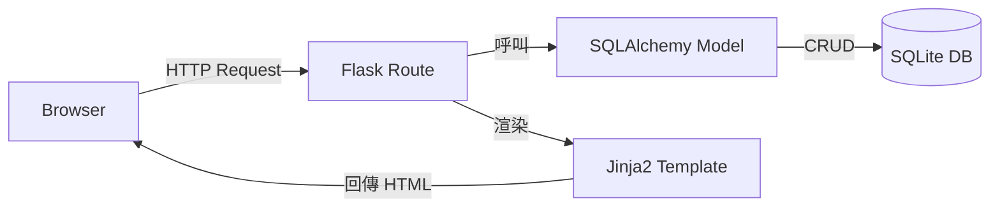

# 系統架構文件 (ARCHITECTURE)

## 1. 技術架構說明
- **後端框架**：Python + Flask
  - 選擇原因：輕量、內建開發伺服器、易於與 SQLite 與 Jinja2 整合，適合個人快速開發。
- **模板引擎**：Jinja2
  - 用於在 Flask route 中渲染 HTML，實現頁面即服務端渲染（SSR），避免前後端分離的額外繁雜。
- **資料庫**：SQLite（透過 SQLAlchemy 或 sqlite3）
  - 單檔資料庫，適合個人本機使用，簡易備份與還原。
- **MVC 架構**：
  - **Model**：`app/models/` 定義資料表與 ORM 類別，負責資料持久化與查詢。
  - **View**：`app/templates/` 使用 Jinja2 撰寫 HTML，負責 UI 呈現。
  - **Controller**：`app/routes/` 定義 Flask 路由與業務邏輯，協調 Model 與 View。

## 2. 專案資料夾結構
```
personal_accounting/
│   app.py                     # Flask 入口腳本
│   config.py                  # 設定檔（資料庫路徑、備份設定）
│
├── app/
│   ├── __init__.py            # 建立 Flask app 與 DB 連線
│   ├── models/                # 資料庫模型
│   │   └── transaction.py
│   ├── routes/                # Controller / Flask 路由
│   │   ├── income.py
│   │   ├── expense.py
│   │   ├── stats.py
│   │   └── utils.py
│   ├── templates/            # View / Jinja2 HTML 模板
│   │   ├── base.html
│   │   ├── income_form.html
│   │   ├── expense_form.html
│   │   └── stats.html
│   └── static/                # CSS / JS / 圖表資源
│       └── style.css
│
├── instance/                  # 儲存實例資料（不納入版本控制）
│   └── database.db           # SQLite 資料庫檔案
│
└── docs/
    ├── PRD.md                # 需求文件（本次已完成）
    └── ARCHITECTURE.md       # 本文件
```

## 3. 元件關係圖


## 4. 關鍵設計決策
1. **單檔 SQLite + 自動備份**：每日備份 `instance/database.db` 至 `backup/` 資料夾，避免資料遺失。
2. **統計與圖表使用 Chart.js**（放於 `static/`），在 `stats.html` 中呈現月度與年度的收支走勢。
3. **安全性**：僅本機執行，使用 Flask 的 CSRF 防護與參數化查詢避免 SQL 注入與 XSS。
4. **擴充性**：資料夾結構採用模組化設計，未來若需多使用者或 API，可在 `routes/` 新增 Blueprint，或在 `static/` 加入前端框架。
5. **部署方式**：使用 `venv` 環境與 `gunicorn`（或 Windows 的 `waitress`）部署為服務，以便未來上傳到雲端或本機自啟動。

---
*此架構文件依據已完成的 PRD 產出，後續可根據實作驗證結果微調細節。*
