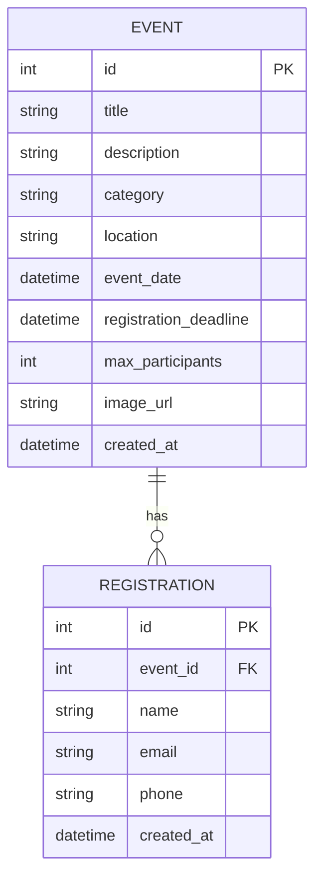

# Database Design Document — 活動報名系統

## 1. ER 圖 (Entity Relationship Diagram)


## 2. 資料表詳細說明

### 2.1 EVENT (活動表)
儲存活動的所有基本資訊。

| 欄位名 | 型別 | 說明 | 必填 | 備註 |
| :--- | :--- | :--- | :--- | :--- |
| id | INTEGER | 主鍵 | 是 | 自動遞增 |
| title | TEXT | 活動標題 | 是 | |
| description | TEXT | 活動詳細內容 | 是 | |
| category | TEXT | 活動類型 | 是 | 如：講座、工作坊、比賽 |
| location | TEXT | 活動地點 | 是 | |
| event_date | DATETIME | 活動開始時間 | 是 | |
| registration_deadline | DATETIME | 報名截止日期 | 是 | |
| max_participants | INTEGER | 名額上限 | 是 | |
| image_url | TEXT | 活動封面圖連結 | 否 | |
| created_at | DATETIME | 建立時間 | 是 | 預設為目前時間 |

### 2.2 REGISTRATION (報名表)
儲存使用者的報名資訊，並與活動表關聯。

| 欄位名 | 型別 | 說明 | 必填 | 備註 |
| :--- | :--- | :--- | :--- | :--- |
| id | INTEGER | 主鍵 | 是 | 自動遞增 |
| event_id | INTEGER | 所屬活動 ID | 是 | 外鍵，參照 EVENT.id |
| name | TEXT | 報名者姓名 | 是 | |
| email | TEXT | 報名者 Email | 是 | |
| phone | TEXT | 報名者電話 | 是 | |
| created_at | DATETIME | 報名時間 | 是 | 預設為目前時間 |

## 3. SQL 建表語法 (SQLite)
檔案位置：`database/schema.sql`

```sql
-- 活動表
CREATE TABLE IF NOT EXISTS events (
    id INTEGER PRIMARY KEY AUTOINCREMENT,
    title TEXT NOT NULL,
    description TEXT NOT NULL,
    category TEXT NOT NULL,
    location TEXT NOT NULL,
    event_date DATETIME NOT NULL,
    registration_deadline DATETIME NOT NULL,
    max_participants INTEGER NOT NULL,
    image_url TEXT,
    created_at DATETIME DEFAULT CURRENT_TIMESTAMP
);

-- 報名表
CREATE TABLE IF NOT EXISTS registrations (
    id INTEGER PRIMARY KEY AUTOINCREMENT,
    event_id INTEGER NOT NULL,
    name TEXT NOT NULL,
    email TEXT NOT NULL,
    phone TEXT NOT NULL,
    created_at DATETIME DEFAULT CURRENT_TIMESTAMP,
    FOREIGN KEY (event_id) REFERENCES events (id) ON DELETE CASCADE
);
```

## 4. Python Model 程式碼 (SQLAlchemy)
將實作於 `app/models/event.py` 與 `app/models/registration.py`。
每個 Model 會包含基礎的 CRUD 方法：`create`, `get_all`, `get_by_id`, `update`, `delete`。
