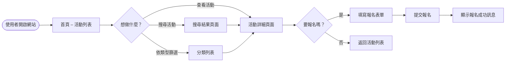
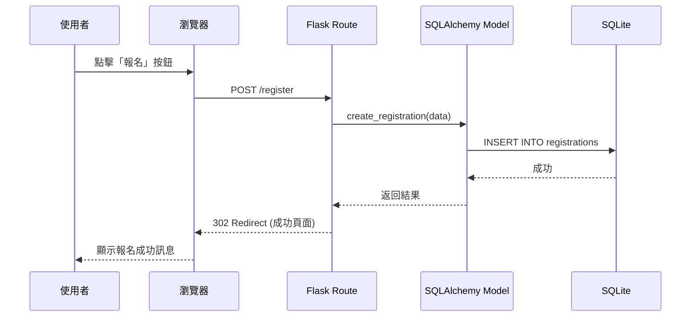

# Flowchart Documentation (流程圖文件)

## 使用者流程圖 (User Flow)

## 系統序列圖 (System Sequence Diagram)

## 功能清單對照表 (Feature Table)
| 功能 | URL 路徑 | HTTP 方法 |
|------|----------|----------|
| 刊登活動說明及報名連結 | /events/create | POST |
| 查看活動列表 | /events | GET |
| 搜尋活動 | /events/search | GET |
| 查看活動詳細 | /events/<id> | GET |
| 報名活動 | /events/<id>/register | POST |
| 查看報名人數 | /events/<id>/registrations | GET |
| 用戶登入/註冊 (可選) | /auth | POST |

*此文件由 Antigravity AI 產生，根據 PRD 與 Architecture 產出，可直接放入 GitHub 或 Notion 預覽。*
